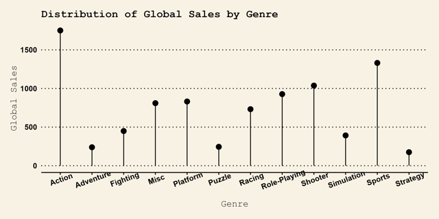

# Portfolio

---

## Data Science
### [Machine Learning 2](https://github.com/caneta9999/UsandoMachineLearning-Projetos2)
 
 Repositório criado para armazenar projetos de Machine Learning, como Regressão, Detecção de Objetos, Aprendizagem por Reforço, entre outros. Desenvolvidos com ferramentas como Python e R.
 Também possuo um outro repositório com o mesmo propósito, só que um pouco mais antigo e menos estruturado: [Machine Learning](https://github.com/caneta9999/UsandoMachineLearning-Projetos)

---
### [Power BI](https://drive.google.com/drive/u/0/folders/1o1pWwGThcNKxJIpAcpyJP4Ejw6yietJW)
  
 Dashboards feitos com a ferramenta Power Bi Desktop, disponibilizados em formatos de PDF para facilitar a visualização.
 Os arquivos podem ser encontrados no repositório: [PowerBI-Dashboards](https://github.com/caneta9999/PowerBI-Dashboards)

---
### Banco de Dados
 
 Repositórios criados para armazenar projetos e testes realizados com linguagens voltadas para bancos de dados relacionais e não relacionais:
- [SQL Projetos](https://github.com/caneta9999/UsandoSQL-Projetos)
- [PL/SQL](https://github.com/caneta9999/PLSQL-Tests)
- [MongoDB](https://github.com/caneta9999/MongoDB)

---
### + Projetos
  
  Outros projetos relacionados, desenvolvidos com Python e R.
- [R Charts](https://github.com/caneta9999/R-Charts)
- [Python PETL](https://github.com/caneta9999/Python-PETL)
- [PySpark](https://github.com/caneta9999/PySpark)

---
## Desenvolvimento
### Python
Além dos códigos de Machine Learning, também possuo outros projetos desenvolvidos utilizando Python para diversos propósitos, como uso de diferentes bibliotecas e funcionalidades:
- [Coletânea de Projetos](https://github.com/caneta9999/UsandoPython-Projetos)
- [POO](https://github.com/caneta9999/OOPPython)
- [Automation](https://github.com/caneta9999/AutomationPython)
- [PhotoCollage com Anilist API](https://github.com/caneta9999/PhotoCollage_AnimeCharacters)

---
### Web
Códigos webs desenvolvidos utilizando diferentes ferramentas.
#### HTML/JS/PHP
- [Jogo da Velha com Javascript](https://github.com/caneta9999/JavaScript-Jogo-da-Velha)
- [Sistema de Avaliação de Disciplinas](https://github.com/caneta9999/sistema-avaliacaodisciplinas)
- [Sistema de Gerenciamento de Vendas para Lanchonete](https://github.com/caneta9999/sgv-lanchonete)
- [Projeto Web](https://github.com/caneta9999/Projeto-Web)

#### Vue.JS
- [Vue com Mongoose](https://github.com/caneta9999/Teste-Vue-Mongoose-Express-Axios)
- [CRUD Vue](https://github.com/caneta9999/CRUD-Vue-JSONServer-Axios)

#### Python Frameworks
- [Football Django](https://github.com/caneta9999/Football-Django)
- [React com Flask](https://github.com/caneta9999/Teste-React-Flask)

#### Outros
- [Calculadora Bhaskara React](https://github.com/caneta9999/Calculadora-Bhaskara-React)
- [CRUD NextJS + Prisma + PostgreSQL](https://github.com/caneta9999/CRUD-NextJS-Prisma-PostgreSQL)
- [Sistema de Login com Express e MongoDB](https://github.com/caneta9999/SistemaLogin-Express-MongoDB)

---
#### + Projetos

 Outras aplicações desenvolvidas para propósitos não listados previamente:
- [Java POO](https://github.com/caneta9999/Projeto-POO)
- [Conversor de Medidas Android com Java](https://github.com/caneta9999/Conversor-Medidas-Android)
- [Rectangle Game C#](https://github.com/caneta9999/Rectangle-Game)

---

Page template forked from <a href="https://github.com/evanca/quick-portfolio">evanca</a>

<!-- Remove above link if you don't want to attibute -->
